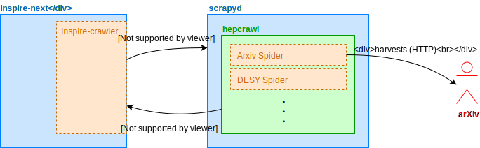

..
    This file is part of hepcrawl.
    Copyright (C) 2015, 2016, 2017 CERN.

    hepcrawl is a free software; you can redistribute it and/or modify it
    under the terms of the Revised BSD License; see LICENSE file for
    more details.

.. currentmodule:: hepcrawl

Inspire-Crawler integration
===========================

``inspire-crawler`` is used to schedule the crawls in scrapyd. The task
`schedule_crawl <https://github.com/inspirehep/inspire-crawler/blob/master/inspire_crawler/tasks.py>`_
is used for this purpose. This task schedules a crawler job using the scrapyd API.

Scrapyd then harvests the record.

A harvested record, after going through the pipeline, is passed to ``inspire-crawler``,
and more precisely a celery task
`submit_results <https://github.com/inspirehep/inspire-crawler/blob/master/inspire_crawler/tasks.py>`_
is scheduled. This task creates the workflow for the record that was harvested, and the record,
appears in the holdingpen.

``CrawlResult`` (defined `here <https://github.com/inspirehep/hepcrawl/blob/master/hepcrawl/api.py>`_)
is the object that is being sent with the ``submit_results`` task, it specifies the protocol of
interaction with `inspire-crawler`. Additionaly to the record is can pass metadata such as
file name, error and traceback.

